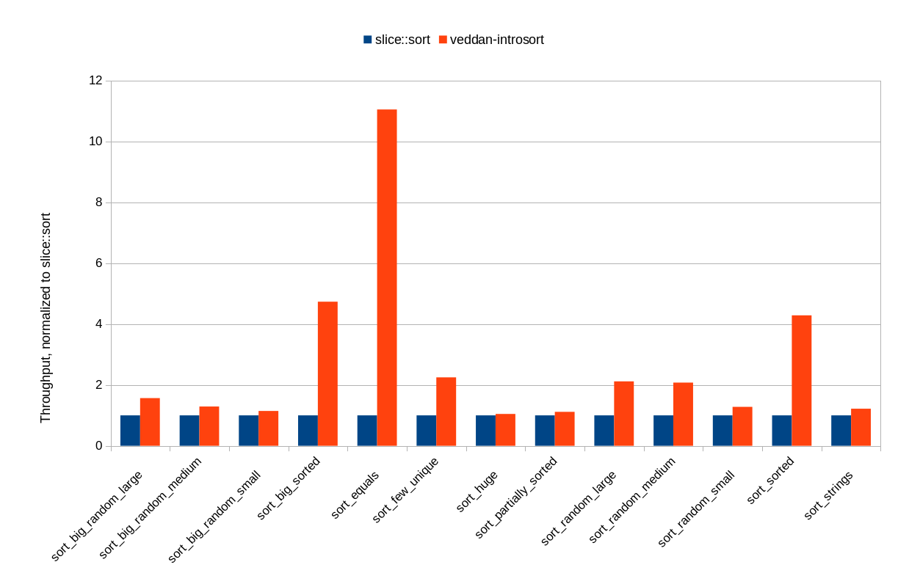

# Introsort #
This is an implementation of the introsort algorithm.
At its heart, it is a dual-pivot quicksort.
It detects excessive recursion during quicksort and switches to heapsort if need be, guaranteeing O(n log(n)) runtime on all inputs.
For small partitions it uses insertion sort instead of quicksort.

This crate does not depend on `std`, and can be used with `#![no_std]` crates.
It does however depend on `core`.

## Interface ##
The interface is similar to the standard library `sort` and `sort_by` functions.
One difference is that `introsort::sort_by` uses new-style "unboxed" closures for its comparison function.

An example:
```rust
    #![feature(slicing_syntax)]
    #![feature(unboxed_closures)]
    extern crate introsort;

    fn main() {
        let mut ss = vec!["Introsort", "or", "introspective", "sort", "is",
                          "a", "hybrid", "sorting", "algorithm", "that",
                          "provides", "both", "fast", "average",
                          "performance", "and", "(asymptotically)", "optimal",
                          "worst-case", "performance"];
        introsort::sort(ss[mut]);
        println!("alphabetically = {}", ss[]);
        introsort::sort_by(ss[mut], &|&: a: &&'static str, b: &&'static str|
                                        a.len().cmp(&b.len()));
        println!("by length = {}", ss[]);
    }
```

Unlike the standard library sort function, introsort is _not_ a stable sort.

## Performance ##
It is quite fast, outperforming the standard sort on my benchmarks.
For a more comprehensive (and more accurate) comparison with std,
see `perf.txt`.


